## REQUISITOS

- Drivers para juegos instalados (drivers propietarios de nvidia o amd)
- sistema actualizado

## Instalación de KVM

Primero instalaremos KVM/QEMU, donde este será la base para alojar nuestras máquinas virtuales. Esta tecnología nos permite convertir nuestro sistema operativo (arch btw, aunq sirve cualquier linux) en un hipervisor de tipo 1, consiguiendo algo como Proxmox o VMware ESXi.
La principal ventaja de este enfoque es que, a diferencia de VMware Workstation o VirtualBox (hipervisores de tipo 2), no se virtualiza el hardware por encima del sistema operativo anfitrión. En su lugar, la virtualización se realiza de manera más directa y cercana al hardware, lo que se traduce en un rendimiento superior, menor latencia y una gestión más eficiente de los recursos del sistema.

### Revisando Soporte para KVM
#### Soporte para virtualización

Primero revisaremos si tenemos la virtualización en la bios activada:

```bash
lscpu | grep -i Virtualization
# tambien podemos utilizar el siguiente comando
cat /proc/cpuinfo | grep -E "vmx|svm|0xc0f" # Son lo mismo
```

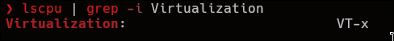
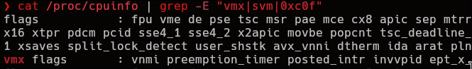

`VT-x` es para Intel y `AMD-Vi` es para AMD (duh), en el caso de que no nos aparezca nada, quiere decir que la virtualización no esta activada por lo que deberemos entrar en la bios y activarla.
#### Soporte del kernel
Ahora debemos verificar que nuestro kernel tiene los módulos de KVM y que dichos módulos se cargan automáticamente, para ello:
```bash
zgrep CONFIG_KVM /proc/config.gz
```

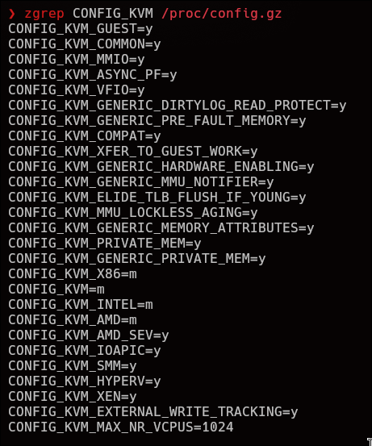

Cuando el output nos muestra `y` este quiere decir que el modulo viene cargado con el kernel, cuando muestra `m` quiere decir que el modulo no esta cargado pero puede ser cargado (que también es parte del kernel) y, por ultimo si nos aparece `n` o esta vacío, esto quiere decir que nuestro kernel no tiene soporte para este modulo, en ese caso podríamos re-compilar el kernel con soporte para KVM o instalar un kernel que ya lo incluya (lo mas sencillo).

Ahora para asegurarnos que los modulos se cargan automaticamente ejecutamos el siguiente comando:

```bash
lsmod | grep kvm
```

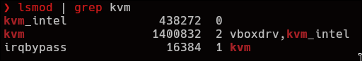

Si en el output no nos aparece nada, podemos probar a cargarlos manualmente con `modprobe`, en este caso deberíamos cargar `kvm` y `kvm_intel` o `kvm_amd` .
- Para que los módulos del kernel carguen automáticamente debemos crear un archivo de configuración con los módulos a cargar:

```bash
sudo nano /etc/modules-load.d/kvm.conf
# Dentro de nano 
kvm
kvm_intel # o kvm_amd
```

- Guardamos el archivo, reiniciamos el ordenador y [verificamos si los módulos han cargado]().
##### Virtualización anidada

Si queremos poder virtualizar dentro de nuestras maquinas virtuales podemos habilitar la `nested virtualization` o virtualización anidada, para ello podemos hacerlo manualmente des-cargando modulos del kernel y volviendo a cargarlos con argumentos:

```bash
modprobe -r kvm_intel # Des-cargamos el modulo de kvm de itel
modprobe kvm_intel nested=1 # Lo cargamos con el argumento de nested activo
```

También podemos hacer como antes para cargar automáticamente con la virtualización  anidada activada

```bash
sudo nano /etc/modules-load.d/kvm_nested.conf
options kvm_intel nested=1 # options para indicar que le damos un parametro
```

##### SEGURIDAD EXTRA - AMD SEV / INTEL TDX

En la gama de servidores encontramos tecnologías que mejoran la seguridad de las maquinas virtuales. 

A partir de los procesadores EPYC de AMD y XEON de Intel, existen tecnologías como **AMD SEV** e **INTEL TDX**. Estas a grandes rasgos nos permiten cifrar la memoria RAM de la maquina virtual para de esta manera ni el **host** (SO), ni el **hypervisor** (VMware, KVM, etc.), ni el usuario **ROOT** puedan leer esta.

Esto se traduce en que si el sistema anfitrión es comprometido por malware o ciber-criminales, estos no puedan leer la memoria RAM de la máquina virtual, si roban un servidor (bastante difícil) o el hypervisor tenga alguna vulnerabilidad puedan leer, de nuevo, la memoria de la máquina virtual.

Para habilitarlo (por ejemplo AMD SEV) es tan sencillo como hemos hecho anteriormente.
Cargamos con modprobe los módulos al kernel en un archivo de config para q se carguen automáticamente.

```bash
sudo nano /etc/modules-load.d/kvm.conf
options kvm_amd sev=1 # options para decirle q le ponemos un argumento
```

Lo habilitamos en GRUB:

```bash
sudo nano /etc/default/grub
GRUB_CMDLINE_LINUX="... mem_encrypt=on kvm_amd.sev=1"
```

Guardamos, generamos nueva config y reiniciamos

```bash
sudo grub-mkconfig -o /boot/grub/grub.cfg # o donde tengamos isntalado grub
sudo reboot
```

### Instalando QEMU, libvirt, viewers y tools.

Una vez nos hemos asegurado que nuestro `CPU` y `kernel` tienen soporte tanto para virtualización como KVM activada vamos a instalar las herramientas necesarias para crear, gestionar y optimizar nuestras máquinas virtuales, como `qemu-full`, `libvirt`, `virt-manager`, entre otras.

```bash
sudo pacman -S qemu-full qemu-img libvirt virt-install virt-manager virt-viewer edk2-ovmf dnsmasq swtpm guestfs-tools libosinfo tuned
```

- `qemu-full` : encargado de la comunicación entre el host y las VMs
- `qemu-img`: para crear y convertir imágenes de disco (como convertir disco de virtualbox a qemu).
- `libvirt`: API y demonio para la gestión de la plataforma de virtualización (para poder administrar kvm).
- `virt-install`& `virt-manager`: Nos permiten creación y administración de máquinas invitadas tanto desde la línea de comandos como mediante una interfaz gráfica.
- `virt-viewer` : para poder acceder a consolas gráficas (se comunica con SPICE para dar video)
- `edk2-ovmf` : Habilitar soporte **UEFI**.
- `dnsmasq` : para dar **DHCP** y **DNS** a las redes **NAT** dentro de **QEMU/KVM**.
- `swtpm`: Emulador TMP.
- `guestfs-tools` : Binario que nos permite comandos avanzados para gestionar las máquinas virtuales.
- `libosinfo` : Es el encargado de autodetectar el sistema operativo para la creacion de la máquina virtual en **Virt Manager**.
- `tuned` : Optimizador del rendimiento del hipervisor ajustandolo a nuestras necesidades.

### Habilitando el demonio de libvirt

Una vez hemos instalado las herramientas necesarias vamos a iniciar el demonio libvirt en modo “modular” ya que el monolitico no es compatible con virtualbox.

```bash
for drv in qemu interface network nodedev nwfilter secret storage; do
    sudo systemctl enable virt${drv}d.service;
    sudo systemctl enable virt${drv}d{,-ro,-admin}.socket;
done
```

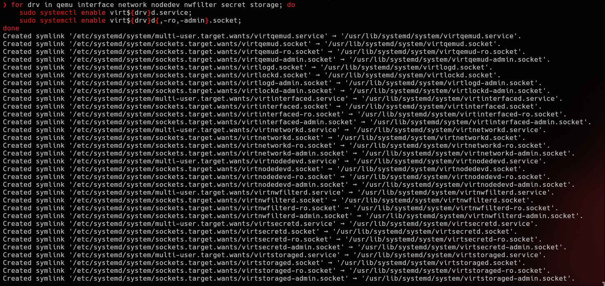


### Verificando Virtualización
Verificamos el estado de la virtualización

```bash
sudo virt-host-validate qemu
```

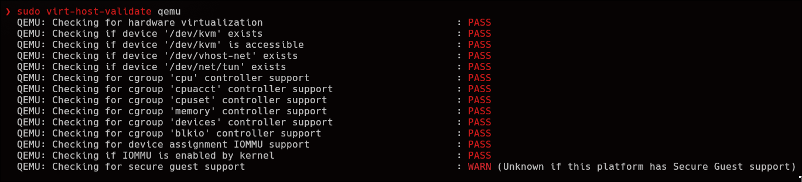

### Habilitamos le IOMMU en con GRUB

```bash
sudo nano /etc/default/grub
...
GRUB_CMDLINE_LINUX="... intel_iommu=on iommu=pt" # o amd_iommu=on para AMD
# Guardamos el archivo y salimos
# Regeneramos el archivo de config de grub
sudo grub-mkconfig -o /boot/grub/grub.cfg
sudo reboot # Reiniciamos
```

### TuneD

Como indiqué anteriormente instalamos tuned para optimizar el sistema para virtualizar, este se encarga de *twekear* parametros como:
- CPU governor ( decide si subir MHz o bajar o si priorizar rendimiento o ahorro de energia)
- I/O scheduler ( En rasgos generales permite reducir latencia, mas eficiencia  y rendimiento.)
- Ajustes de red (puede aumentar el tamaño de buffer TCP)
- Frecuencia de GPU (irrelevante vamos a pasarla a la VM)
- Energía / rendimiento

Primero habilitamos el inicio automático de este y lo activamos ahora.

```shell
sudo systemctl enable --now tuned.service
```

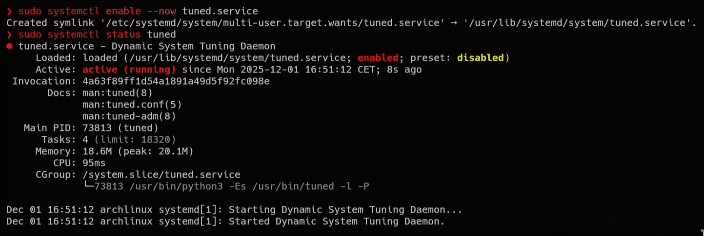

Una vez habilitado modificamos el perfil actual a `virtual-host`.

```shell
tuned-adm active # ver el perfil actual
# Current active profile: balanced
tuned-adm list # listamos los perfiles y nos aparece virtual-host
sudo tuned-adm profile virtual-host # lo cambiamos a virtual-host
tuned-adm active # Verificamos de nuevo el perfil actual
# Current active profile: virtual-host
sudo tuned-adm verify # Verificar si el perfil se ha aplicado correctamente
```

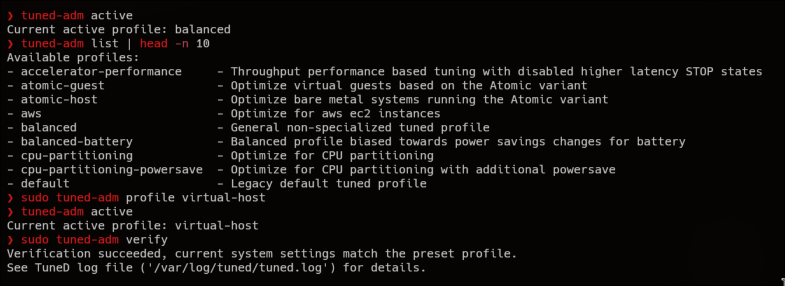

### Libvirt en system mode

Actualmente si verificamos el estado de libvirt encontraremos que esta en modo `sesion`, esto quiere decir que esta en modo usario. En este estado tenemos privilegios muy limitados y no podemos hacer la principal ventaja de esta guia que es `GPU PASSTHROUGH`, por lo que vamos a cambiarlo a modo sistema.

Para ello primero verificamos en que modo estamos:

```bash
sudo virsh uri
# qemu:///session
```

Añadimos nuestro usuario a el grupo libvirt

```bash
sudo usermod -aG libvirt $USER
```

Modificamos nuestro archivo de configuracion de shell para que el default url sea `system`

```bash
echo 'export LIBVIRT_DEFAULT_URI="qemu:///system"' >> ~/.bashrc # o .zshrc
sudo virsh uri

```

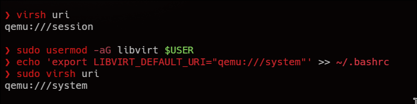

### Modificando los permisos de imagenes

Las imagenes de las maquinas virtuales se guardan en `/var/lib/libvirt/images`, este es un directorio que solo root puede acceder, por lo que vamos a modificarlo para que nosotros como usuario normal podamos acceder a este.

Borramos las ACL existentes

```bash
sudo setfacl -R -b /var/lib/libvirt/images/
```

Damos permiso a nuestro usuario

```bash
sudo setfacl -R -m "u:${USER}:rwX" /var/lib/libvirt/images/
```

Otorgamos permiso a archivos futuros:

```bash
sudo setfacl -m "d:u:${USER}:rwx" /var/lib/libvirt/images/
```

### Redes en KVM

Por defecto en KVM las máquinas virtuales se conectan a la red NAT default de este, la cosa es que si queremos poder conectarla a la red y poder conectarnos desde otros pc o algo por el estilo, debemos crear una red *bridge*, en el caso de que no quieras, puedes skipear esto.

En el caso de las redes bridge no funcionan en NICs inhalambricos (wifi), solo en puertos eth, si tienes Wifi, de nuevo skipea esto.

En este caso la guia de Redes en KVM esta basada en `NetworkManager` asi que si usas otro manager de redes, usa ese.

#### Default Network

Para la gente que tenga un NIC de wifi o no quiera sacar a su red las VMs, vamos a configurar un poco mas la red default para aumentar la seguridad. ya que aunque por defecto **KVM** nos genere una red **NAT** y sus respecivas iptables, te voy a enseñar a modificar la red NAT y vamos a setear reglas de **firewall** para mejorar la seguridad.

Para listar las redes virtuales
```bash
sudo virsh net-list --all
```
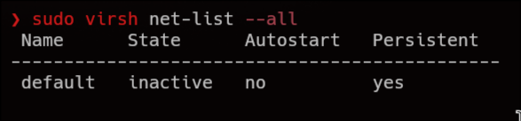

Para activar una red 

```bash
sudo virsh net-start default
```


Para hacer que auto-inicie

```bash
sudo virsh net-autostart default
```


Dumpear el .xml de la red default

```bash
virsh net-dumpxml default > default.xml
```

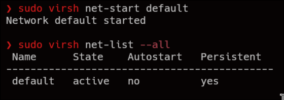

Podemos basarnos en este archivo para modificarlo y generar nuevas redes NAT. Vamos a setear el firewall, es el siguiente archivo:

```bash
#!/usr/bin/nft -f

flush ruleset; # limpia todas las posibles reglas que haya para poner una nueva

define qemu_iface = "virbr0"; # actua sobre la interfaz virbr0 (default)

table inet filter { 
	chain input { # que va a nuestro PC host
		type filter hook input priority filter; policy drop; # tira todas las conexiones al pc

		ct state established,related accept; # Pero mantiene las conexiones como por ejemplo cuando envias una traza icmp que te devuelva la respuesta

		iifname "lo" accept comment "allow loopback"; # permite loopback
		iifname $qemu_iface accept comment "allow qemu"; # permite trafico de las vms al host, si no lo quieres quitalo

		tcp dport http accept comment "allow sending http"; # permite web
		tcp dport https accept comment "allow sending https"; # de nuevo
		udp dport 67 udp sport 68 accept comment "allow sending dhcp"; # permite dhcp
		tcp dport ssh accept comment "allow ssh"; # permite ssh

		counter drop; # deshabilita todo el resto.
	}

	chain forward { # salida a internet
		type filter hook forward priority filter; policy drop; # droppea todo

		ct state established,related accept; # pero mantiene las relacionadas

		iifname $qemu_iface accept comment "forward qemu input";
		oifname $qemu_iface accept comment "forward qemu output";
# mantiene trafico entre maquinas virtuales e internet
		counter drop; # el resto lo tira
	}
}

table ip nat { # setea que el trafico sea en ipv4
	chain postrouting {
		type nat hook postrouting priority srcnat; policy accept;
		ip saddr 192.168.122.0/24 masquerade;
	} # todo lo que salga de 192.168.122.0/24 lo hace masquerade (NAT)
}

```

Para poder usar estas reglas de firewall no debemos usar ni UFW ni firewalld ya que entran en conflicto.

#### Bridge Network

Esto es para los que quieran que salga en bridge la maquina virtual. Para ello primero debemos ver el nombre de nuestra interfaz.

```bash
sudo nmcli device status
```

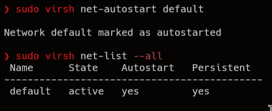

Usando nmcli vamos a crear una interfaz para el bridge

```bash
sudo nmcli connection add type bridge con-name bridge0 ifname bridge0
```


Conectamos la interfaz ethernet (`enp102s0`)  a la nueva interfaz bridge

```bash
sudo nmcli connection add type ethernet slave-type bridge con-name 'Bridge connection 1' ifname enp2s0 master bridge0
```

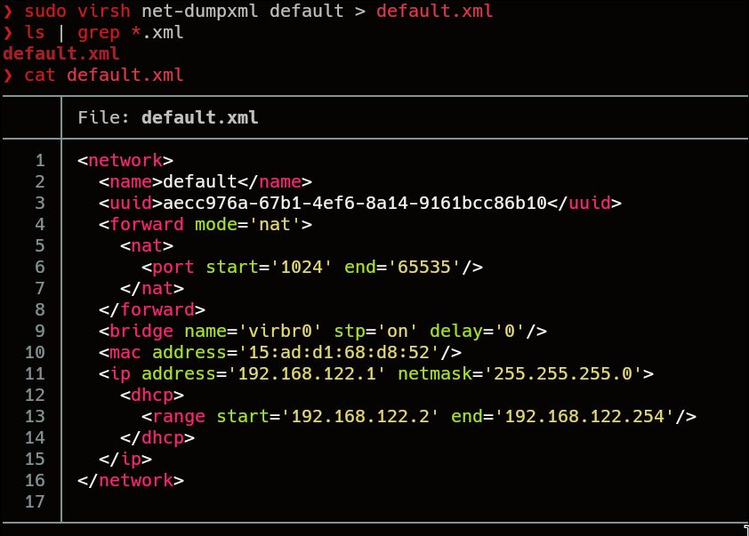

Ativamos la nueva interfaz, le habilitamos el autoconect (que se auto inicie) & listamos las interfaces.

```bash
sudo nmcli connection up bridge0
sudo nmcli connection modify bridge0 connection.autoconnect-slaves 1
sudo nmcli connection up bridge0
sudo nmcli device status
```

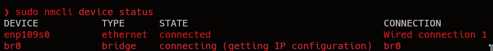

##### Habilitar en virsh (Virtual Machine Manager) la interfaz bridge

Una vez hemos creado la interfaz, vamos a *setearla* en Virtual Machine Manager. Por lo que vamos a crear un archivo `.xml` llamado bridge con el nombre de la red `bridge`, el modo `bridge` y la interfaz `bridge0`

```xml
<network>
    <name>bridge</name>
    <forward mode="bridge" />
    <bridge name="bridge0" />
</network>
```

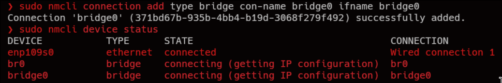

Añadimos la red en virsh `net-define`, le habilitamos el autostart y ya esta.

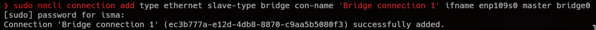
