# Configurando la maquina virtual de Windows 11

Para crear la maquina virtual de Windows 11 en este caso es sencillo, simplemente debemos abrir `Virtual Machine Manager`. Una vez abierto entramos en File>Edit > Preferences 

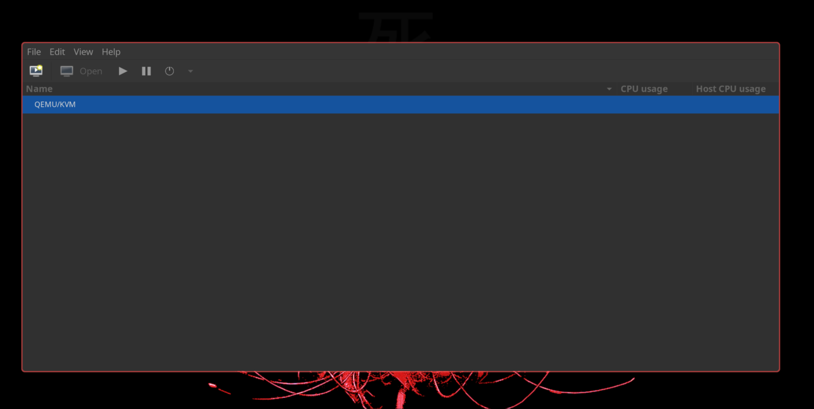

Una vez dentro Habilitamos `Enable XML editing` y nos dirigimos a la pestaña `New VM` 

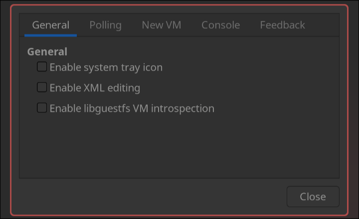

Una vez dentro, vamos a cambiar el storage format de qcow2 a Raw (en el caso de que no tengamos un disco hdd/ssd/nvme al que hacer passthrough), ya que este nos permite tener mas velocidad, entraremos mas en profundidad mas tarde.

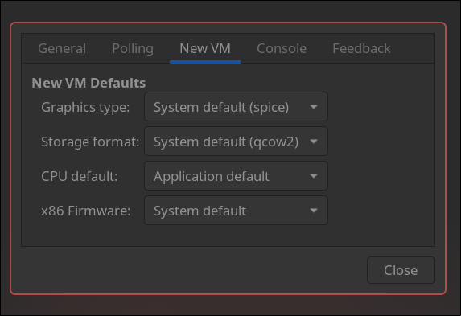

Una vez hecho el cambio, debería verse de la siguiente manera:

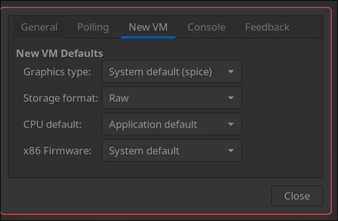

Una vez hecho, cerramos y hacemos click al icono de `Create a new virtual machine`

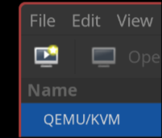

Le damos a forward.

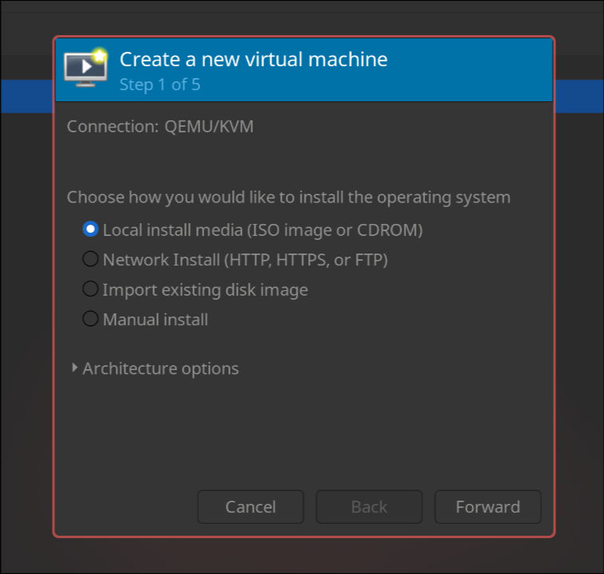

Hacemos click en `Browse` para seleccionar nuestra iso, una vez hecho, le damos a `Forward`

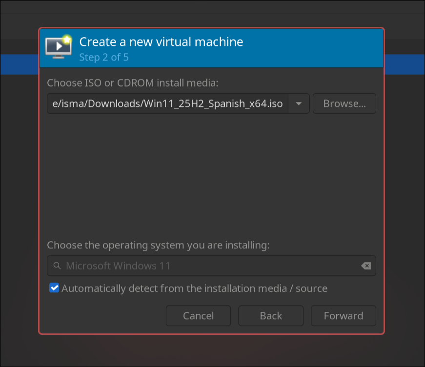

Seleccionamos la ram que queramos para la maquina virtual y los nucleos lo podemos dejar en 4, ya que despues lo vamos a modificar.

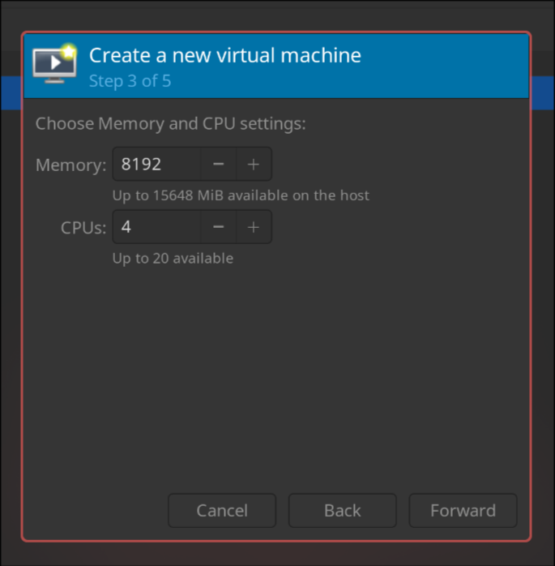

En este caso seleccionamos el tamañano de disco que queremos que tenga nuestro windows (en este caso he escogido 60g). 

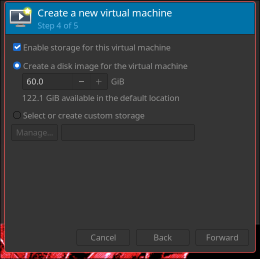

Y una vez en esta ultima pantalla, le ponemos el nombre que queremos a la vm y **SELECCIONAMOS** `Customize configuration before install`. Esto nos permitira seguir configurando la maquina virtual.

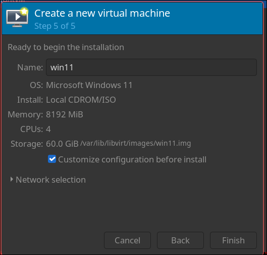

Una vez aqui, nos aseguramos que tengamos el chipset en `Q35` y firmware `UEFI`.

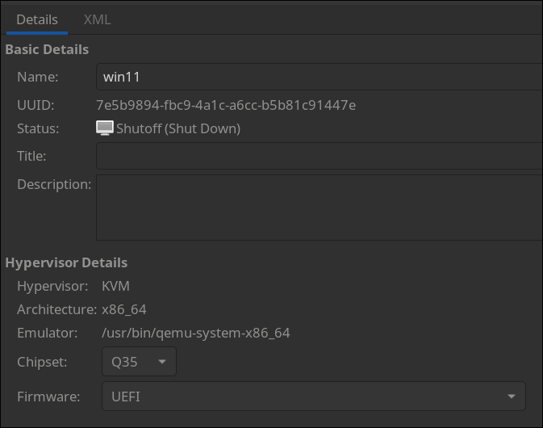

Ahora la **CPU**, la cosa es que si lo dejamos como esta y expandimos `Topology`, podemos ver que ha configurado nuestra maquina virtual con 4 `sockets` y cada uno con 1 `core` y 1 `thread`. En este caso quiere decir que **el hipervisor (KVM/QEMU)** nos ha creado 4 cpus por lo que windows piensa que tenemos 4 procesadores de 1 nucleo y 1 hilo. Por lo que vamos a seleccionar `Manually set CPU topology` para configurarlo correctamente.

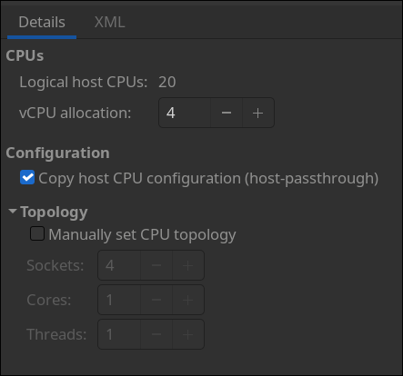

En este caso para setear los nucleos y procesadores de la maquina virtual correctamente, vamos a fijarnos en el numero que tenemos arriba donde pone `Logical host CPUs:`

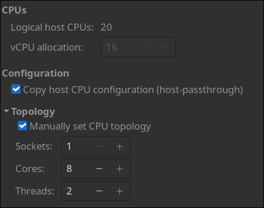

En este caso tenemos 20, por lo que quiere decir que en total mi procesador tiene 20 cpus lógicas por lo que si vieramos la topología de nuestro procesador (**lo haremos mas tarde**), seria algo como 10 nucleos y 2 hilos por cada nucleo por lo que en total (2\*10 = 20) tenemos 20 CPUs lógicas o vCPUs. En este caso vamos a darle 16 vCPUs para dejar 4 al host.

Por lo que para ello dejaremos en sockets 1 (que solo tenga un procesador nuestra maquina virtual), le podré 8 nucleos y 2 hilos por cada nucleo. Quedará de la siguiente manera:

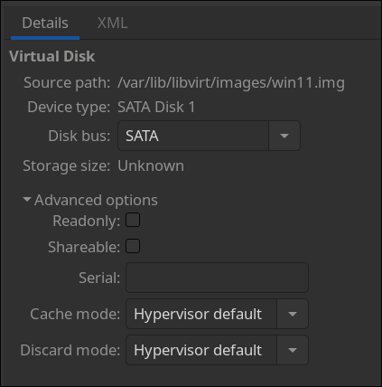

Una vez acabado, vamos al apartado de Nuestro disco, en este caso, si entramos, encontramos que es de tipo SATA, este lo vamos a cambiar a VirtIO, ya que obtenemos diferentes ventajas, entre ellas:
- Menor latencia
- Menor uso de CPU (no tiene que emular)
- Arranca mas rápido
- Y mucho mas.

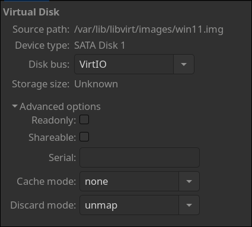

Por lo que despues de enumerar las diferentes ventajas de VirtIO como dirver de nuestro disco, vamos a cambiarlo de SATA a este y adicionalmente vamos a cambiar el cache a `none` (El SO invitado gestiona su propia caché) y Discard mode `unmap` (Cuando archivos se borran, los bloques se liveran). Para ello vamos a hacer los cambios, y se debería ver de la siguiente manera:

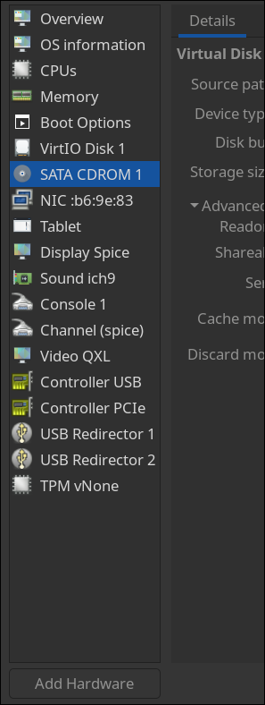

Una vez hecho el cambio del driver de disco, necesitamos añadir los drivers para poder detectarlo dentro de windows por lo que para ello nos dirigiremos a `Add Hardware` 

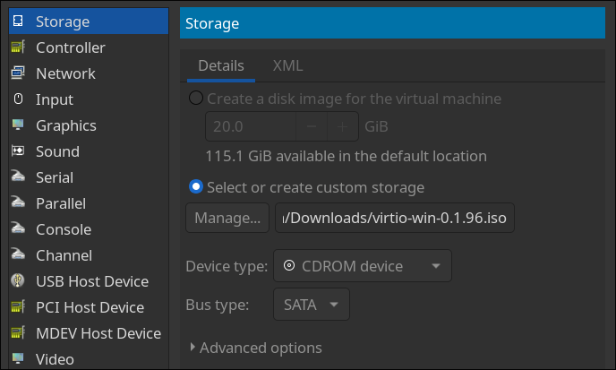

 Dentro seleccionamos en `Device Type` : `CDROM`  y le damos en `Manage` para seleccionar nuestra iso.
 (link para descargar la iso: https://fedorapeople.org/groups/virt/virtio-win/direct-downloads/archive-virtio/?C=M;O=D)
Una vez seleccionado le damos a `Add` 

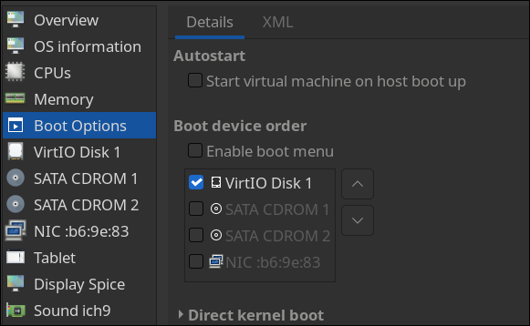

Nos dirigimos en Boot Options para seleccionar el orden de arranque de los discos.

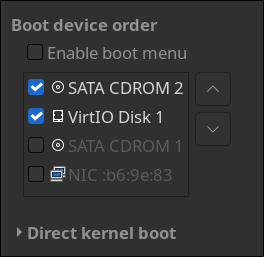

Seleccionamos la ISO que acabamos de añadir y lo ponemos como primera opción.

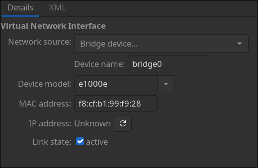

Ahora vamos  a configurar el internet y TMP2.0 y ya estamos.
En este caso, le damos a `NIC :XX:XX:XX`, una vez dentro modificamos de donde vendrá nuestro internet (en este caso haré NAT).

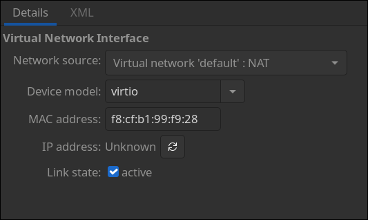

Y en este caso cambiamos el device model de `e1000e` a `virtio`.

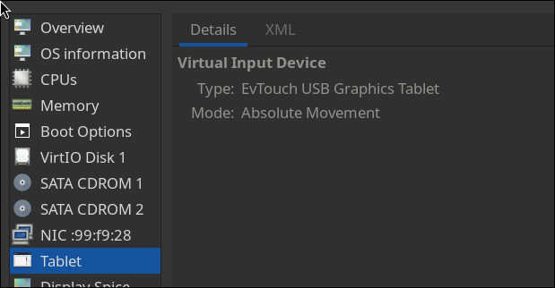

Eliminamos este “modulo”, llamado `Tablet` el cual no lo necesitamos.

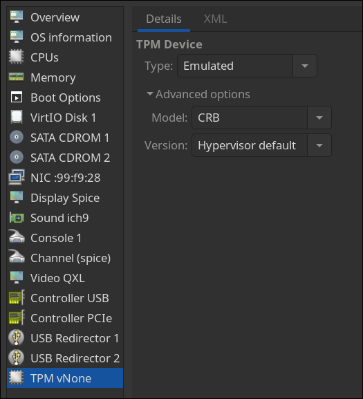

Una vez eliminado nos dirigimos a `TPM vNone` 

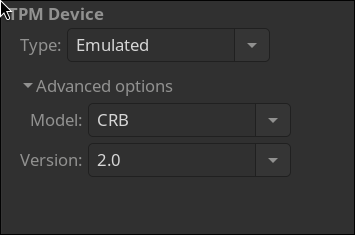

Y modificamos el version a `2.0`  y ya estamos.

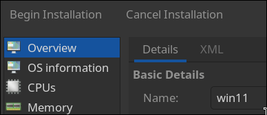

Ahora solo hacemos click en el botón de arriba a la izquierda donde pone `Begin Instalation` y ya podemos iniciar con la instalación de Windwos11.
