## GPU Passthrough

Una vez instalado Windows 11 y configurado, ahora tenemos que hacer el passthrough de la gráfica, para ello primero debemos de verificar que se encuentre en el mismo grupo de IOMMU (Tus dispositivos PCI se dividen en grupos, denominados grupos IOMMU. Tu GPU se encuentra en uno o varios de estos grupos, y debe pasar a la máquina virtual la totalidad del grupo que contiene su GPU.). Por lo que ejecutaremos el siguiente script dentro de nuestra terminal para revisar que nuestra gráfica se encuentre con su audio dentro del mismo grupo IOMMU

```bash
#!/bin/bash
shopt -s nullglob
for g in /sys/kernel/iommu_groups/*; do
    echo "IOMMU Group ${g##*/}:"
    for d in $g/devices/*; do
        echo -e "\t$(lspci -nns ${d##*/})"
    done;
done;
```

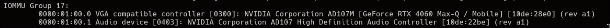

En este caso mi grafica y mi audio (HDMI) estan dentro del mismo grupo, por lo que por mucho que no vaya a usar el audio por HDMI, también lo tengo que pasar a la maquina virtual.

Vamos a configurar libvirt, en este caso debemos modificar el siguiente archivo  y descomentar las siguientes lineas.

```bash
sudo nano /etc/libvirt/libvirtd.conf
```

```bash
unix_sock_group = "libvirt"

unix_sock_rw_perms = "0770"
```

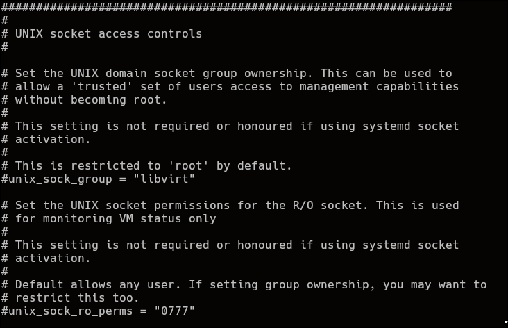

Una vez hecho metemos a nuestro usuario actual dentro de los grupos kvm y libvirt.

```bash
sudo usermod -a -G kvm,libvirt $(whoami)
```

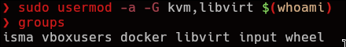

Una vez hecho reiniciamos libvirt.

```bash
for drv in qemu interface network nodedev nwfilter secret storage; do
    sudo systemctl restart virt${drv}d.service;
    sudo systemctl restart virt${drv}d{,-ro,-admin}.socket;
done
```

Una vez reiniciado, modificamos el siguiente archivo, donde entre las lineas `518` y `524` deberemos reemplazara `root` por nuestro usuario, en este caso `isma`.

```bash
sudo nano /etc/libvirt/qemu.conf
```

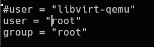

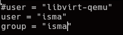

### Parcheando la vbios de la GPU

Ahora debemos parchear la ROM de nuestra GPU, esto es obligatorio dentro de NVIDIA aunque algunos AMD también, el proceso es bastante sencillo, pero que cada uno lo haga bajo su propio riesgo, si quieres intentarlo bajo tu responsabilidad.

Descargar la herramienta [NVFLASH](https://www.techpowerup.com/download/nvidia-nvflash/) ([AMDVFLASH](https://www.techpowerup.com/download/ati-atiflash/) para amd), haces click sobre `CTRL + ALT + F2`, una vez ahí, te loguees y paras el display manager (en mi caso sddm)

```bash
sudo systemctl stop sddm # en el caso que uses systemd
```

Una vez dentro, descargamos los modulos de nvidia del kernel en el siguiente orden:

```markdown
1. sudo rmmod nvidia_uvm
2. sudo rmmod nvidia_drm
3. sudo rmmod nvidia_modeset
4. sudo rmmod nvidia
```

(Aveces en algunas GPUs un servicio llamado `nvidia-persistenced` te puede frenar al intentar descargar algunos modulos, para ello simplemente ejecuta el siguiente comando para pararlo temporalmente:`sudo systemctl stop nvidia-persistenced`)

Una vez descargado solo hacemos lo siguiente:
```bash
# Donde hayamos descargado el script de nvflash
sudo chmod +x nvflash
sudo ./nvflash --save vbios.rom
```

Y ya esta, ahora simplemente podemos cargarlos los modulos de kernel de nuevo

```bash
sudo modprobe nvidia
sudo modprobe nvidia_uvm
sudo modprobe nvidia_drm
sudo modprobe nvidia_modeset

# y ejecutamos nuestro display manager (en mi caso sddm)

sudo systemctl start sddm
```

Este ejemplo es para Nvidia, en el caso de amd los modulos que se tienen que descargar son los siguientes:

```bash
# DEscargar modulos AMD
sudo rmmod drm_kms_helper
sudo rmmod amdgpu
sudo rmmod radeon

# Dumpear vbios
sudo chmod +x amdvbflash
sudo ./amdvbflash -s 0 vbios.rom

# Cargar modulos
sudo modprobe drm_kms_helper
sudo modprobe amdgpu
sudo modprobe radeon
```

Si no te sientes seguro dumpeando tu rom, puedes descargarla desde [aqui](https://www.techpowerup.com/vgabios/), de nuevo, bajo tu propia responsabilidad.

Una vez tenemos la vbios, vamos a patchearla, para ello la abrimos dentro de `OKTETA`.

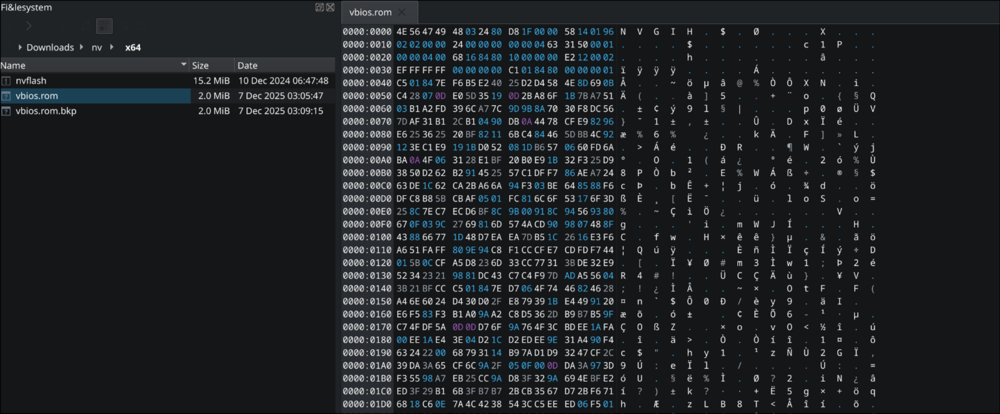

Una vez dentro hacemos click sobre `CTRL + F` para filtrar por `VIDEO` en `Char`.

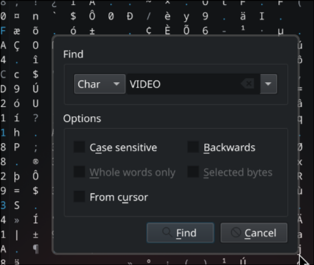

Una vez encontrado, seleccionamos desde la `U` que hay enfrente de `VIDEO`

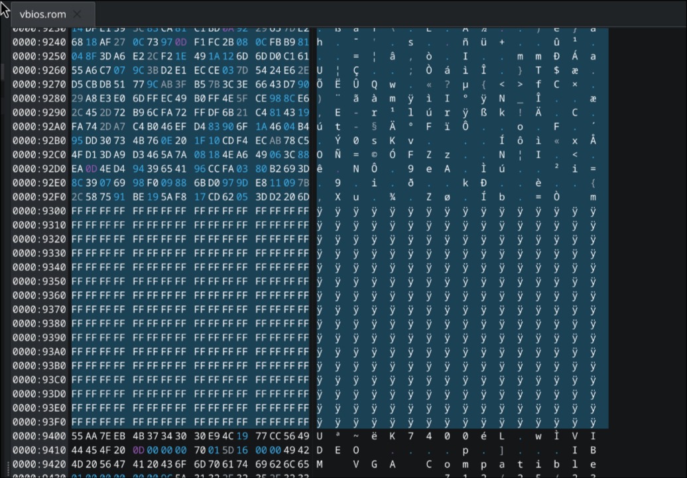

Cambia el modo a edit con la tecla `insert` y pulsa `DEL` para eliminar todo eso para que quede de la siguiente manera:

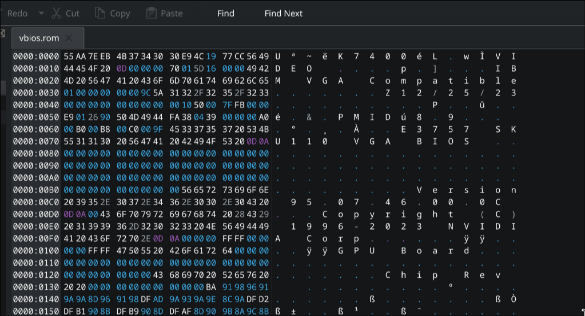

Una vez hecho, creamos una carpeta llamada vgabios y lo metemos ahi con los permisos 644.

```bash
sudo mkdir /usr/share/vgabios
sudo cp patched.rom /usr/share/vgabios/
cd /usr/share/vgabios
sudo chmod 644 patched.rom
sudo chown $(whoami):$(whoami) patched.rom
```


### Scripts

Una vez parcheada la rom, vamos a “hijackear” la gpu de linux y pasarsela en caliente a windows, por lo que para ello utilizaremos hooks (Creamos el directorio para el:).

 ```bash
sudo mkdir /etc/libvirt/hooks
```

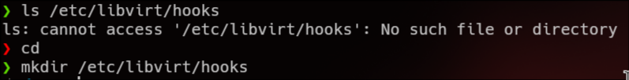

Una vez dentro, instalamos tree para poder visualizar mejor la estructura de directorios.

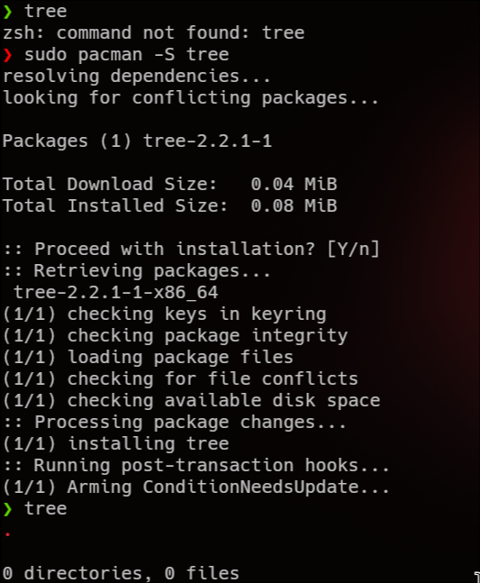

Crearemos la estructura de archivos dada por la documentación de [libvirt](https://www.libvirt.org/hooks.html#id8), los tenemos que crear dentro del directorio `/etc/libvirt/hooks` y la carpeta que va despues de **qemu.d** (`win11`), debeis sustituirlo por el nombre de la maquina virtual.

```bash
mkdir -p qemu.d/win11/prepare/begin/
mkdir -p qemu.d/win11/release/end/
```

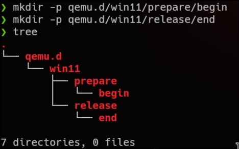

Una vez hecho tendrá la estructura mostrada en el `tree`, dentro de `/etc/libvirt/hooks` vamos a descargarnos un script.

```bash
sudo wget 'https://raw.githubusercontent.com/PassthroughPOST/VFIO-Tools/master/libvirt_hooks/qemu' -O /etc/libvirt/hooks/qemu

sudo chmod +x /etc/libvirt/hooks/qemu # le damos permisos de ejecución
```

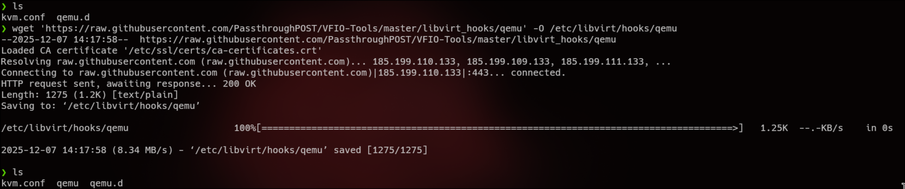

Ahora vamos a crear el script que se ejecutara antes de iniciar la maquina virtual, para ello hacemos nano (o el editor de texto que queramos) al siguiente directorio.

```bash
nano qemu.d/win11/prepare/begin/start.sh 
```

El primer paso del script es (como cuando dumpeamos la vbios) parar el **display manager**.

Para saber cual tenemos debemos ejecutar el siguiente comando:

```bash
readlink /etc/systemd/system/display-manager.service
```

En este caso tengo sddm

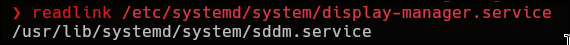

Por lo que el script se vería de la siguiente manera:

```bash
#!/bin/bash
systemctl stop sddm
systemctl isolate multi-user.target

sleep 5 # Esperamos 5 segundos para asegurarnos de que se para el servicio sddm
```

Ahora debemos asegurarnos de cuantas `vtconsoles` tenemos, por lo que para ello ejecutamos el siguiente comando:

```bash
ls /sys/class/vtconsole
```

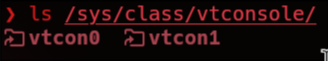

En este caso tenemos 2 (la 0 y la 1) por lo que hacemos bind a esas 2, despues unbindeamos el framebuffer del efi, los modulos de nvidia y por ultimo cargamos los modulos de vfio.

```bash 
systemctl stop sddm
systemctl isolate multi-user.target

while systemctl is-active --quiet sddm.service; do
	sleep 1
done

echo 0 > /sys/class/vtconsole/vtcon0/bind
echo 0 > /sys/class/vtconsole/vtcon1/bind

echo efi-framebuffer.0 > /sys/bus/platform/drivers/efi-framebuffer/unbind

## Unload NVIDIA GPU drivers ##
modprobe -r nvidia_uvm
modprobe -r nvidia_drm
modprobe -r nvidia_modeset
modprobe -r nvidia
modprobe -r i2c_nvidia_gpu
modprobe -r drm_kms_helper
modprobe -r drm

## Load VFIO-PCI driver ##
modprobe vfio
modprobe vfio_pci
modprobe vfio_iommu_type1
```

Una vez hecho, vamos a hacer lo mismo pero al revés para `/release/end/revert.sh`. Se debería ver de la siguiente manera:

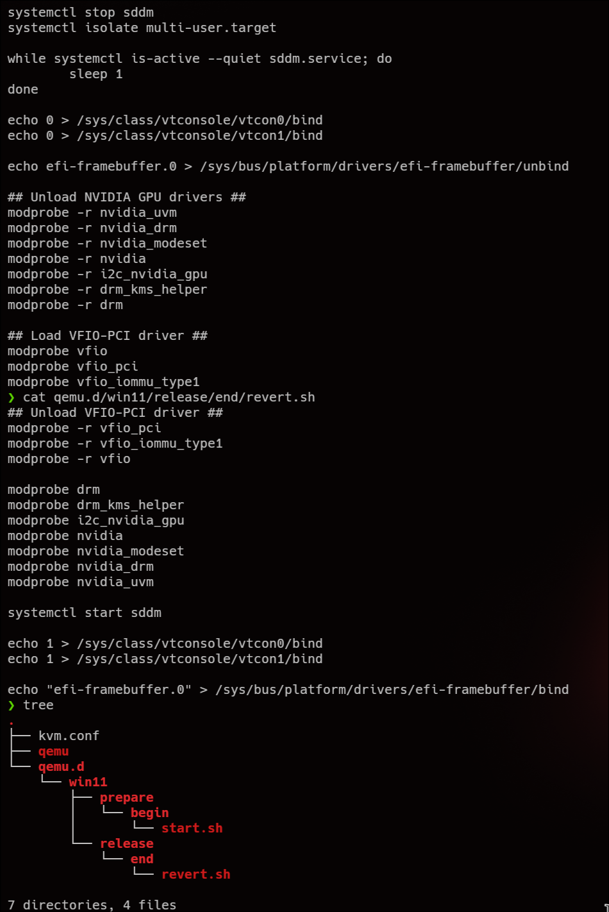

Una vez hecho, vamos a `virtual machine manager`, y en `Add`>`PCI Host Device`. Añadimos tanto la grafica como el audio HDMI.

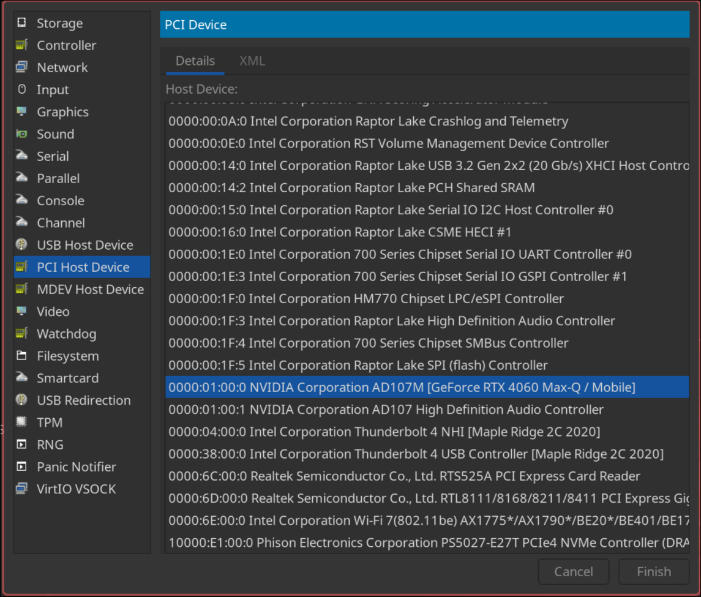

Entramos en la grafica y en XML, le añadimos la siguiente linea para darle el archivo ROM:

```XML
`<rom file='/usr/share/vgabios/patched.rom'/>`
```

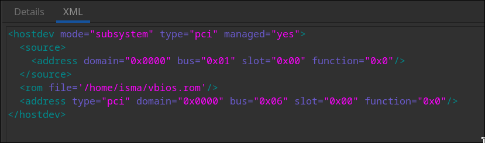

Adicionalmente **eliminamos**  cualquier `spice` o `virtual monitor`. Una vez hecho, iniciamos la VM.

Una vez ejecutada vemos que seguimos sin grafica, para ello le tenemos que instralar los drivers.

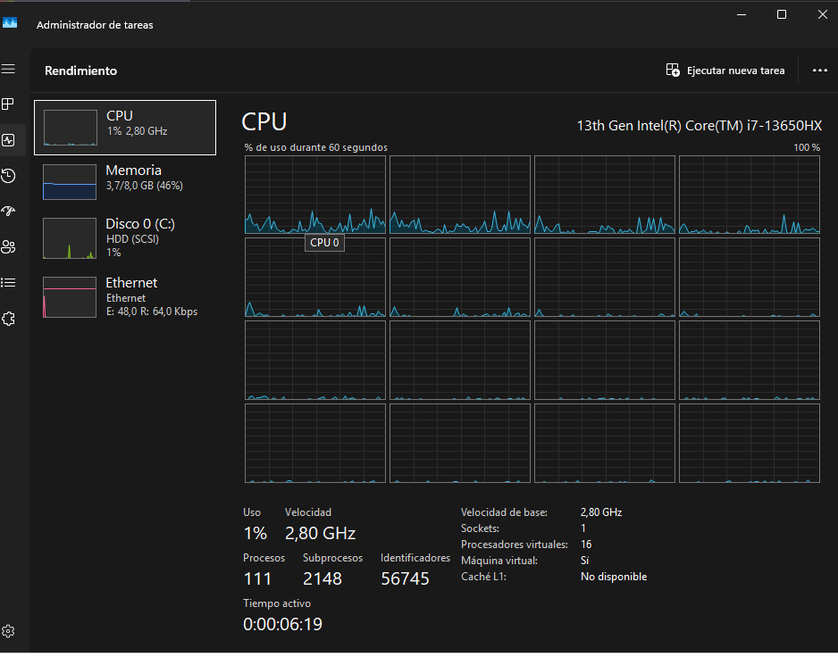

Dentro de administrador de tareas tampoco sale.

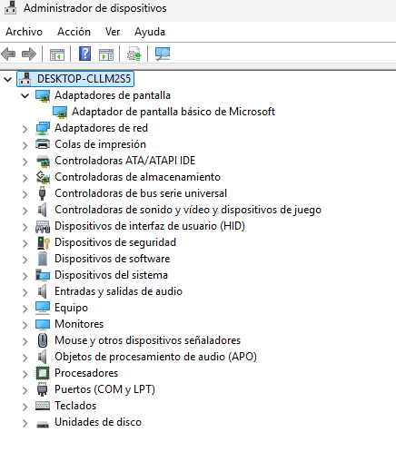

Procedemos con la instalación de los drivers NORMALES de nuestra grafica.

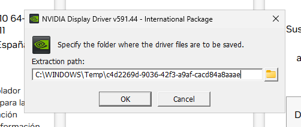

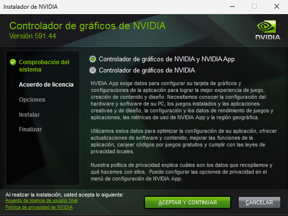

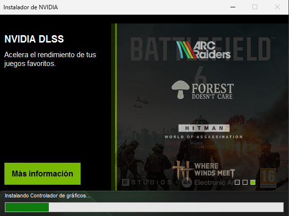

Una vez acabe, ahí reconocerá nuestra targeta grafica.

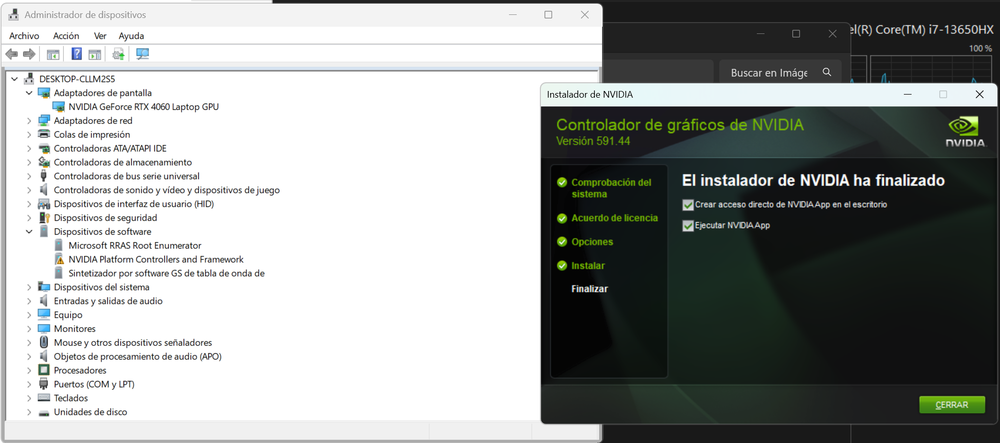

Si entramos en ajustes, vemos como nos esta soportando 2k a 165hz.

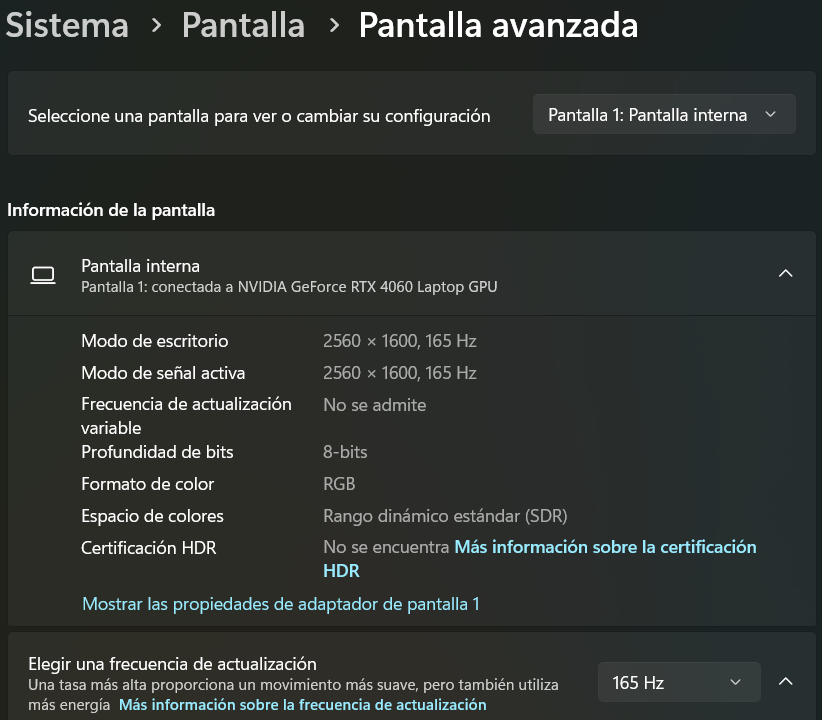
