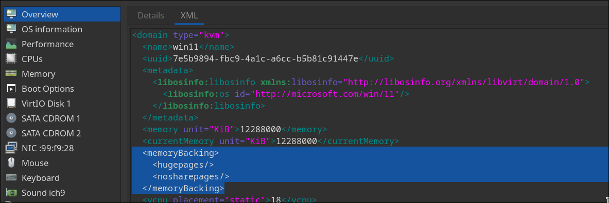
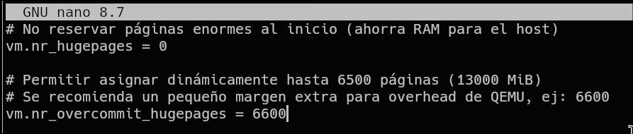
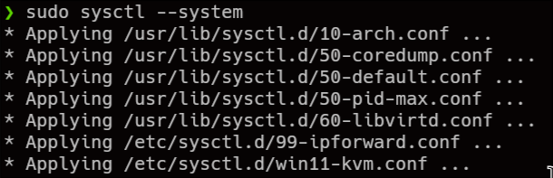

# HUGE PAGES

Ahora solo queda la paginación de la RAM. Podemos hacer paginación de RAM estatica, pero en este caso la haremos dinamica, ya que si lo hacemos estatica la RAM estará reservada desde el inicio de ARCH por lo que con solo 16gb de RAM, no es una opción viable.

En este caso le hemos dado “14336”Mib de RAM a la vm, por lo que vamos a hacer que una vez se pare el sddm por lo que en consecuencia se habran terminado los procesos corriendo en la sesión del usuario (es lo que mas ocupa), lo reservaremos para la maquina virtual, por lo que añadimos el parametro `memoryBacking` en xml:

```XML
  <memoryBacking>
    <hugepages/>
    <nosharepages/>
  </memoryBacking>
```



Ahora vamos a crear el archivo de configuración para definir el comportamiento de la memoria para la maquina virtual win11 KVM (al kernel). 

```bash
sudo nano /etc/sysctl.d/win11-kvm.conf
```

```bash
# No reservar páginas enormes al inicio (ahorra RAM para el host)
vm.nr_hugepages = 0

# Permitir asignar dinámicamente hasta 6500 páginas (13000 MiB)
# Se recomienda un pequeño margen extra para overhead de QEMU, ej: 6600
vm.nr_overcommit_hugepages = 6600
```



Ahora forzamos que recarguen los parametros del kernel sin reiniciar la maquina virtual:


