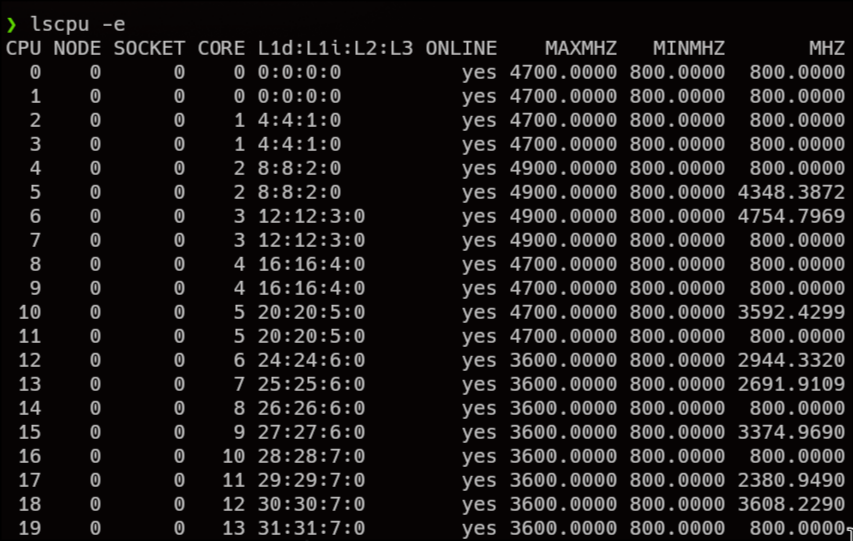
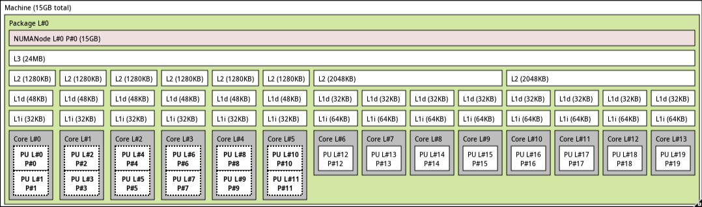
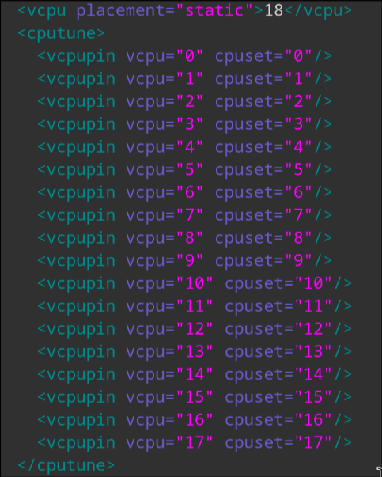

# CPU PINING

Una vez finalizada la configuración de **GPU Passthrough**, el siguiente paso es implementar **CPU Pinning**. Para comprender su utilidad, es importante analizar primero el contexto actual **sin CPU Pinning**.

En la situación actual, mientras la máquina virtual está en ejecución, el sistema host (**Arch Linux**, en mi caso, **btw**) y el sistema invitado (**Windows**) compiten dinámicamente por el uso de los núcleos del procesador. Esta contención de recursos provoca que, en escenarios donde el procesador tiene un papel determinante —especialmente en videojuegos, además de la carga gráfica—, el rendimiento no sea óptimo.

El **CPU Pinning** soluciona este problema asignando de forma explícita determinados núcleos del procesador a la máquina virtual. De este modo, dichos núcleos quedan reservados exclusivamente para el sistema invitado, impidiendo que el host los utilice y garantizando así un acceso estable y predecible a los recursos de CPU, lo que se traduce en una mejora notable del rendimiento y la latencia.

Por lo que primero debemos configurar la topologia de nuestro procesador, para ello utilizaremos el siguiente comando:

```bash
lscpu -e

lstopo # es mas grafico
```



```bash
lstopo
```



Encontramos en nuestra topologia de procesador que tenemos 5 P-cores (Performance) y 8 E-cores (Efficient), en este caso tenemos HiperThreading activado, pero solo en 5 nucleos de los 13.
En este caso como tenemos que quitarle video de la maquina y paramos el display manager (sddm), pues como el host solo va a correr cosas como: `systemd`, `I/O scheduler` (o no si hacemos usb pasthrough), por lo que en este contexto 2 E-cores que son 2 nucleos y 2 hilos tienen la suficiente “potencia” como para gestionar esto por lo que nos quedaremos con todos los `P-Cores` para la vm.

Si volvemos a ejecutar `lscpu -e` podemos ver que en este caso seran los vCPUs 18 y 19 que dejaremos al host, por lo que para hacer ello utilizaremos `systemctl` para indicarles que nucleos puede usar el sistema, para que de esta manera el resto se reserven solo para la vm.


```bash
systemctl set-property --runtime -- user.slice AllowedCPUs=18-19
systemctl set-property --runtime -- system.slice AllowedCPUs=18-19
systemctl set-property --runtime -- init.scope AllowedCPUs=18-19
```


Una vez añadamos esto a nuestra configuración, en cuento nuestra máquina virtual inicie, Linux solo podra utilizar los `E-cores` 18 y 19. Por lo que vamos a añadir esto a 
`qemu.d/win11/prepare/begin/start.sh`

```bash
#/etc/libvirt/hooksqemu.d/win11/prepare/begin/start.sh
...
## Load VFIO-PCI driver ##

modprobe vfio
modprobe vfio_pci
modprobe vfio_iommu_type1

## CPU PINNING ##

systemctl set-property --runtime -- user.slice AllowedCPUs=18-19
systemctl set-property --runtime -- system.slice AllowedCPUs=18-19
systemctl set-property --runtime -- init.scope AllowedCPUs=18-19
```

Y una vez puesto hacemos lo mismo pero para release, en este caso le pondremos todos los nucleos (0-19)

```bash
#/etc/libvirt/hooksqemu.d/win11/release/end/revert.sh
## CPU PINNING RELEASE ##

systemctl set-property --runtime -- user.slice AllowedCPUs=0-19
systemctl set-property --runtime -- system.slice AllowedCPUs=0-19
systemctl set-property --runtime -- init.scope AllowedCPUs=0-19


## Unload VFIO-PCI driver ##

modprobe -r vfio_pci
modprobe -r vfio_iommu_type1
modprobe -r vfio
...


```

Ahora Windows no estará constantemente peleándose con arch sobre quien tiene que utilizar que.

Por lo que vamos a configurar la topología de la CPU en la configuración de la VM, para ello entramos en `Virtual Machine Manager`, En la maquina le damos a `Show Virtual Hardware` Y dentro de `Overview` entramos en XML


En vez de usar 16vCPUs vamos a usar 18:

```xml
  <cputune>
    <vcpupin vcpu="0" cpuset="0"/>
    <vcpupin vcpu="1" cpuset="1"/>
    <vcpupin vcpu="2" cpuset="2"/>
    <vcpupin vcpu="3" cpuset="3"/>
    <vcpupin vcpu="4" cpuset="4"/>
    <vcpupin vcpu="5" cpuset="5"/>
    <vcpupin vcpu="6" cpuset="6"/>
    <vcpupin vcpu="7" cpuset="7"/>
    <vcpupin vcpu="8" cpuset="8"/>
    <vcpupin vcpu="9" cpuset="9"/>
    <vcpupin vcpu="10" cpuset="10"/>
    <vcpupin vcpu="11" cpuset="11"/>
    <vcpupin vcpu="12" cpuset="12"/>
    <vcpupin vcpu="13" cpuset="13"/>
    <vcpupin vcpu="14" cpuset="14"/>
    <vcpupin vcpu="15" cpuset="15"/>
    <vcpupin vcpu="16" cpuset="16"/>
    <vcpupin vcpu="17" cpuset="17"/>
  </cputune>
```


Con esto cada ver que se inicie la maquina virtual (de manera automatica) (y durante su ejecucción) arch no podrá acceder a esos nucleos.
